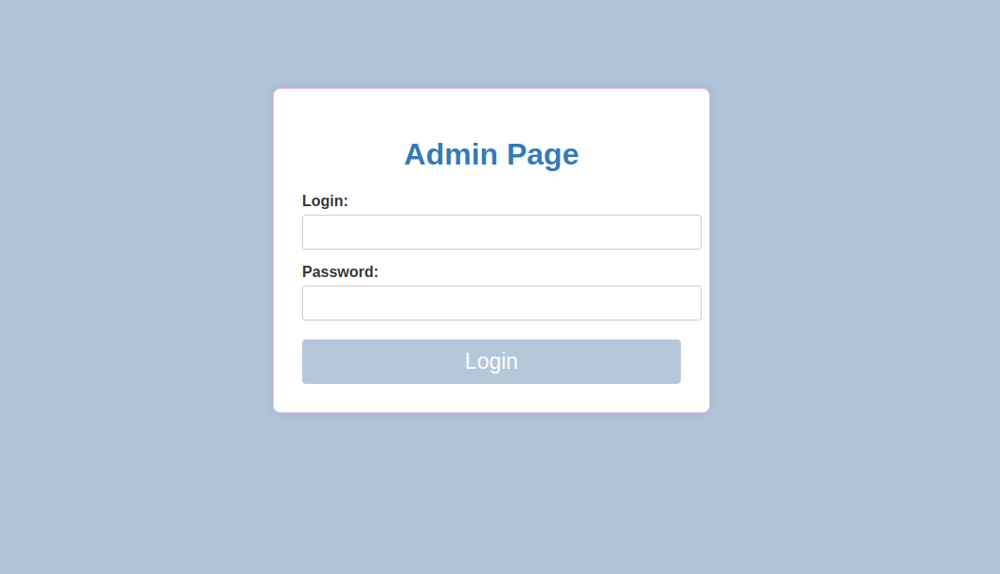
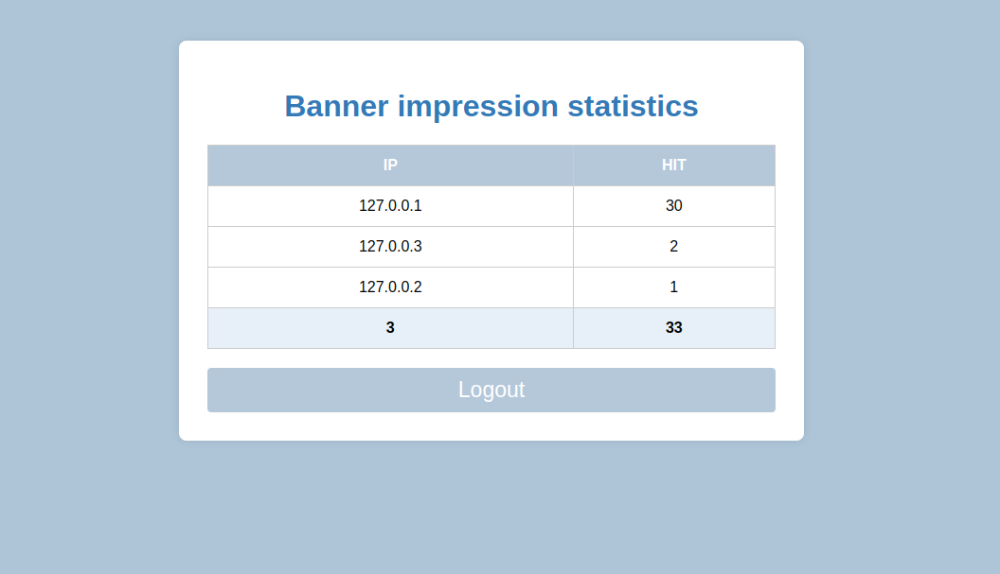

# README

## 📸 Interface Screenshots

### 1. banner.php
   

### 2. admin/login.php
   

### 3. admin/dashboard.php
   

## 🗄️ Database Architecture

### 📊 Table: `banner_stats`

| Field      | Type         | NULL | Key | Default           | Extra             |
|------------|--------------|------|-----|-------------------|-------------------|
| id         | int          | NO   | PRI | NULL              | auto_increment    |
| ip_address | varchar(45)  | NO   | UNI | NULL              |                   |
| hit_count  | int          | NO   |     | 1                 |                   |

---

### 📊 Table: `users`

| Field      | Type          | NULL | Key | Default           | Extra             |
|------------|---------------|------|-----|-------------------|-------------------|
| id         | int           | NO   | PRI | NULL              | auto_increment    |
| login      | varchar(255)  | NO   | UNI | NULL              |                   |
| password   | varchar(255)  | NO   |     | NULL              |                   |
| created_at | timestamp     | YES  |     | CURRENT_TIMESTAMP | DEFAULT_GENERATED |

---

